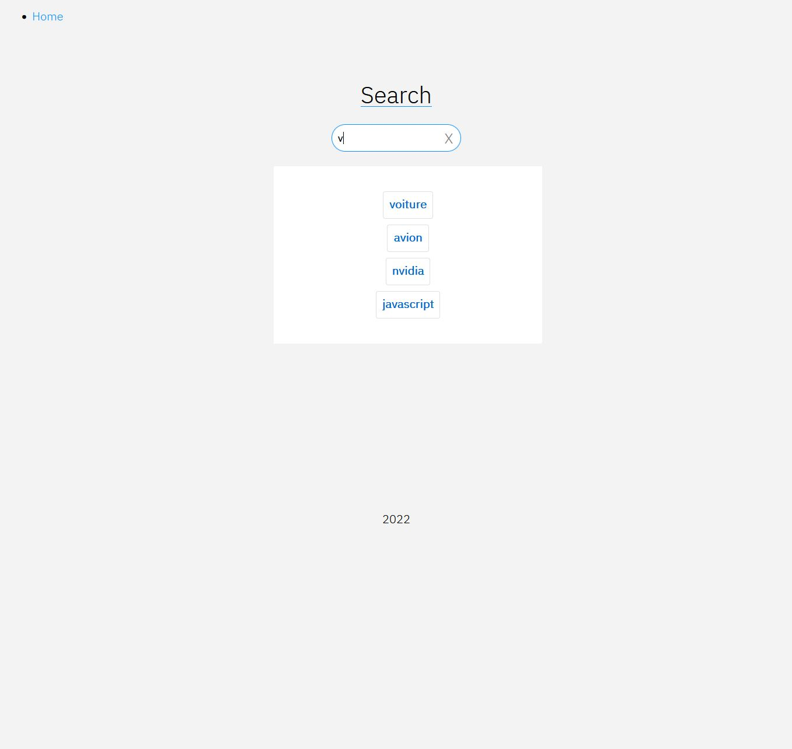

# Search in db with XMLHttpRequest

A mini and simple project for search in database. With XMLHttpRequest PHP MYSQL. 

## Requirements
* PHP >= 7.2
* phpMyAdmin >= 4.5
* MySQL >= 5.7

### Started
Go to folder named "public", and start you'r best PHP Server !
Example with VSCode. CLI : php -S localhost:65000

## Preview

